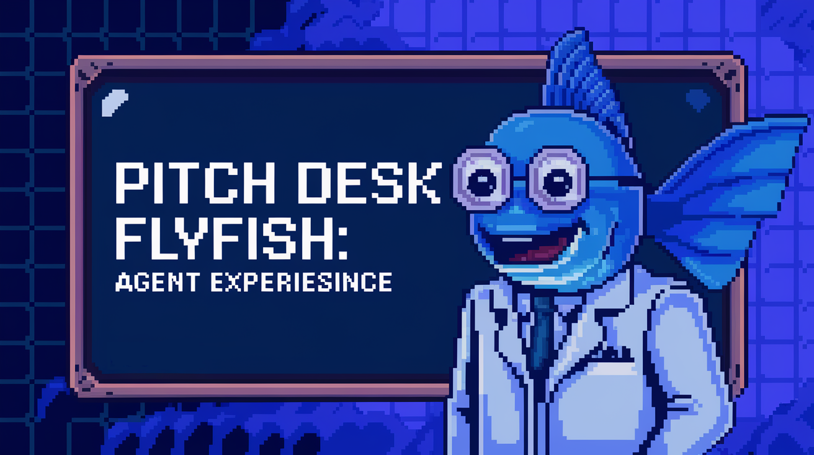

# FlyFish 🐟

> "Info finance is a discipline in which you (i) start with a fact you want to know and (ii) deliberately design a market to optimally elicit that information from market participants." 
> — Vitalik Buterin, _From Prediction Markets to Info Finance_

**FlyFish** is your ultimate AI-powered **InfoFi** assistant, seamlessly powered by **ElizaOS**. By combining AI intelligence with market-driven information distribution, FlyFish transforms how users interact with Web3—especially within the **Movement** Blockchain ecosystem. Whether you're analyzing market sentiment, or seeking blockchain insights, FlyFish leverages AI to tokenize digital interactions and create more efficient, market-driven outcomes.

  

#### Launch Demo🌈: [FlyFish Demo]()

## Table of Contents

- [FlyFish Chat 🐟](#flyfish-chat-) - [Launch Demo🌈: FlyFish Chat Demo](#launch-demo-flyfish-chat-demo)
- [Table of Contents](#table-of-contents)
- [Overview](#overview)
- [Features](#features)
- [Architecture](#architecture)
- [Track](#track)
- [License](#license)

## Overview

FlyFish redefines **`Web3`** interactions by implementing **`AI-powered InfoFi`**, merging artificial intelligence with market-driven information distribution. Powered by **`ElizaOS`**, it transforms complex blockchain tasks into quantifiable, market-valued interactions.

### 🌟 AI-Driven InfoFi Features
- 📈 **Market-Driven Insights** – Gain real-time, **`AI-driven analytics`** where market forces determine value and attention distribution
- 🔄 **Democratized Participation** – Enable all users to capture fair value from their interactions and data
- 📊 **Tokenized Attention** – Transform user engagement into quantifiable assets 
- 🎯 **User-Controlled Data Collection** – Empowering users to selectively capture and save web content they find valuable
- **📊 InfoFi-Enhanced Data Analysis**: Access and analyze market-valued Web3 data collected through the **`FlyFish extension`**. View content whose importance is determined by market forces, stored securely in decentralize storage, enabling more efficient, market-driven decision making.

- **⚡ Market-Validated Queries**: Execute blockchain queries whose relevance and priority are determined by collective market intelligence. Access **`token metrics`**, **`transaction data`**, and **`smart contract`** states through a system that rewards valuable information discovery.

- **🔗 Interactive Knowledge Graph**: Visualize and explore the interconnected relationships between posts and users through an intuitive graph interface. This feature helps users:
  - Discover content connections and user interactions
  - Identify influential users and trending topics
  - Navigate related content through visual exploration
  - Analyze information flow and content distribution patterns

🔥 Step into the future of **`market-driven AI decentralization`**!

## Overview Architecture

- **Frontend Cointainer** will constis of 2 components:
  - **Extension Components**: An extension that enables users to manually select and save website content they're interested in, storing their chosen data securely in decentralize storage. The extension allows users to:
    - Select specific content to save
    - Choose what data they want to collect
    - Store their selected content in decentralize storage
  You can find the extension components in this repository: [Extension Components](https://github.com/Weminal-labs/flyfish-extension)
  - **Web Client Components**: A chat interface that allows users to interact with **`FlyFish agent`** and get **`personalized collected data`** from decentralize storage from extension components above. You can find the web client components in this repository: [Web Client Components]()
- **Agent Container**: A container that contains the agent components.
This is the repository for Agent Container:
[Agent Container]()
This is the repository for building `movement plugin`: 
[Movement Plugin]()
We have publish our plugin in npmjs:
[Movement Plugin NPM]()

For a detailed breakdown of each component, please refer to the architecture documentation in their respective repositories.

## License

This project is licensed under the MIT License - see the LICENSE file for details.